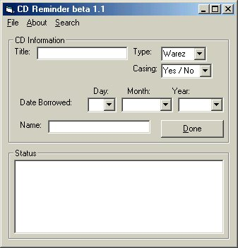



## Cd Lender

### Description

Recently i've been rather absent minded of whom i lend my CDs to, so I came up with this handy little program to help me keep track of who's got what.
 
### More Info
 
In this version, only one cd can be entered per person, but im currently working on that :)

             |
---                |---
**Submitted On**   |2000-10-30 21:07:40
**By**             |[Casey Mullineaux](https://github.com/Planet-Source-Code/PSCIndex/blob/master/ByAuthor/casey-mullineaux.md)
**Level**          |Intermediate
**User Rating**    |4.3 (13 globes from 3 users)
**Compatibility**  |VB 6\.0
**Category**       |[Miscellaneous](https://github.com/Planet-Source-Code/PSCIndex/blob/master/ByCategory/miscellaneous__1-1.md)
**World**          |[Visual Basic](https://github.com/Planet-Source-Code/PSCIndex/blob/master/ByWorld/visual-basic.md)
**Archive File**   |[CODE\_UPLOAD1111910302000\.zip](https://github.com/Planet-Source-Code/casey-mullineaux-cd-lender__1-12402/archive/master.zip)

